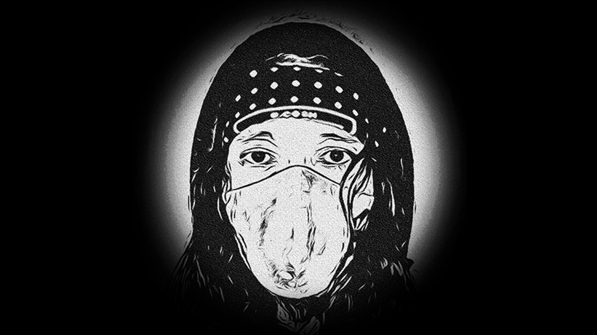

# ⚠️ 0 - Pembukaan

<figure><figcaption>
<strong>Web1 - Web2 - Web3</strong>
</figcaption></figure>

> Telah terjadi kemesraan antara kehidupan nyata yang physical, kugambarkan sebagai daratan, dan kehidupan maya yang digital, kugambarkan sebagai lautan, hingga akhirnya keduanya melebur batasnya menjadi kehidupan physical-digital atau phygital, yang akhirnya kugambarkan sebagai melelehnya semua daratan sehinnga menjadi [**The Melting Land**](https://docs.endhonesa.com/02-the-creations.../waivfves-2/15.-the-melting-land).
>
> — [**Prof. NOTA v.11.0**](https://nota.endhonesa.com/) - November 2021

Ruang-waktu **Web3** itu tersentralisasi dan terdesentralisasi sebab terjadi pergumulan mesra antara entitas tersentralisasi dan protokol terdesentralisasi di sana. Berkunjung dan menjelajahi ruang-waktu **Web3** perlu pemahaman tentang ruang-waktu tersebut.

***

<figure><figcaption>
<strong>Digital Literacy for Everyone</strong>
</figcaption></figure>

> Ruang-waktu memberitahu materi (massa) bagaimana bergerak, materi (massa) memberitahu ruang-waktu bagaimana berbentuk.
>
> — **Albert Einstein**

Desentralisasi jaringan **blockchain** mewujudkan berbagai atribut dan tanggung jawab keamanan di ruang-waktu **Web3**, dan sebagai ruang-waktu yang terdesentralisasi, siapa pun kita harus pasang badan dan bertanggung jawab atas keamanan itu untuk memitigasi, sekaligus mengurangi risiko menjadi korban.

Karena sifat ruang-waktu **Web3** yang terdesentralisasi, cybersecurity atau keamanan siber menjadi perhatian yang utama, tak ubahnya sebuah perhatian untuk seorang kekasih yang dicintai.

***

<figure><figcaption>
<strong>Not Your Keys, Not Your Coins</strong>
</figcaption></figure>

> …Mereka adalah pakaian bagimu, dan kamu adalah pakaian bagi mereka...
>
> — **QS. Al Baqarah: 187**

Selain itu, melindungi wallet-mu yang sifatnya non-custodial, melindungi transaksi, dan data yang terdesentralisai, semua menjadi tanggung jawab masing-masing kita sepenuhnya.

Apalagi di ruang-waktu **Web3** memungkinkan terjadi transfer nilai yang terdesentralisasi dan lingkungan interaktifnya bersifat otonom, maka adanya desentralisasi ini memunculkan beberapa pertukaran tanggung jawab keamanan, dan seperti biasa, masing-masing kita sebagai manusia masih saja menjadi bagian yang lemah di ruang-waktu **Web3**.

***

P.S. Read this document freely for information and guidance. Do not redistribute or restate—no quotes, summaries, paraphrases, or derivatives—without prior written permission from [**Prof. NOTA**](https://nota.endhonesa.com/). Sharing the link is allowed. So, share the link, not the text. Do not discuss or re-tell the contents in any form—written, spoken, or recorded—without prior written permission.

***
